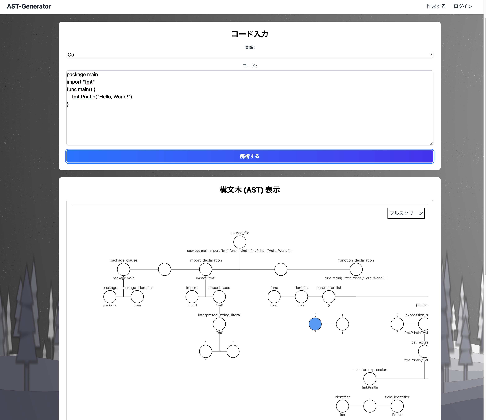

# AST Generator

## 📌 プロジェクト概要

**AST Generator**
は、任意のプログラミングコードから抽象構文木（AST）を生成し、直感的なツリービューで可視化するWebアプリケーションです。

---
> 抽象構文木（AST）の生成・可視化ツール  
> [デモURL](http://ast-generator-alb-882047228.ap-northeast-1.elb.amazonaws.com/)



---

## 🛠 使用技術

| 分類          | 技術・ツール                                                  |
|-------------|---------------------------------------------------------|
| **フロントエンド** | React, TypeScript, Vite                                 |
| **バックエンド**  | Go (Gin Framework)                                      |
| **インフラ**    | Docker, Docker Compose                                  |
| **IaC**     | Terraform                                               |
| **クラウド環境**  | AWS (ECS [Fargate], ECR, RDS, VPC, ALB, NATインスタンス[EC2]) |

---

## 🚀 セットアップ方法

### 1. リポジトリのクローン

```bash
git clone https://github.com/t2469/ast-generator.git
cd ast-generator
```

### 2. Docker Composeでの起動

※初回ビルドが必要な場合は `--build` を付けてください。  
※コンテナ停止時は `docker compose down` を実行します。

```bash
docker compose up -d [--build]
```

---
